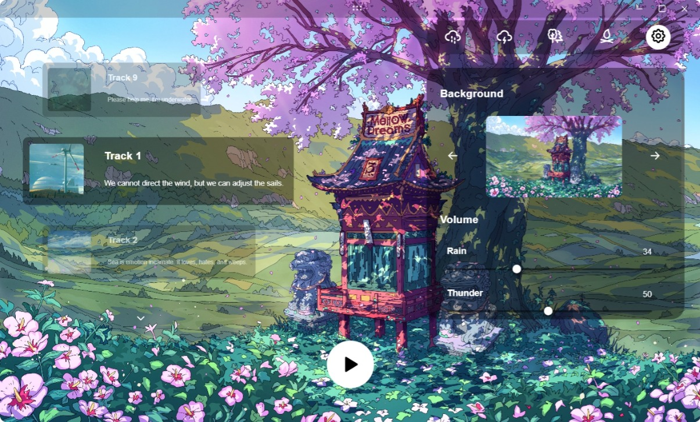
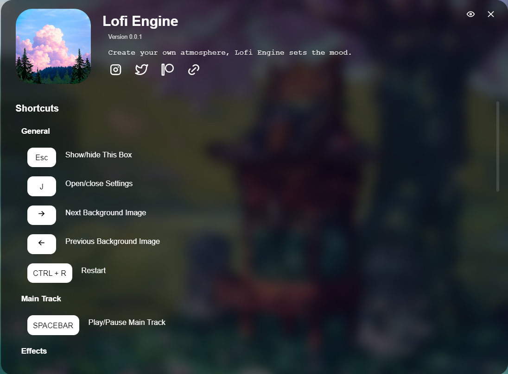

# LoFi Engine
<p align="center">
    
</p>

Generate LoFi music on the go. You create your own atmosphere; LoFi Engine sets the mood.

<p align="center">
  <a href="https://github.com/meel-hd/lofi-engine/releases/tag/app-v1.0.3">
    
  </a>
</p>

<p align="center">
   
</p>

## Table of Contents

- [Introduction](#lofi-engine)
- [Tech Stack](#tech-stack)
- [Roadmap](#roadmap)
- [Features](#features)
- [Run Locally](#run-locally)
- [Contributing](#contributing)
- [License](#license)

## Tech Stack

[](https://svelte.dev/)
[](https://www.typescriptlang.org/)
[](https://vitejs.dev/)
[](https://tauri.app/)
[](https://pnpm.io/)
[](https://tonejs.github.io/)

## Roadmap
- [x] Procedural LoFi track generation using Tone.js
- [x] Customizable ambient tracks
- [x] Customizable effects
- [x] Customizable look and feel
- [x] Keyboard shortcuts for all actions
- [x] Offline support
- [x] Cross-platform support (Linux, Mac, Windows)
- [x] [Browser deployment](https://lofi-engine.vercel.app/)
- [ ] Purchasing a domain
- [ ] Mobile support (iOS, Android)
- [ ] More customization options and effects
- [ ] Improved procedural generation algorithms
- [ ] User feedback integration


## Features
* Create your own LoFi studio with your unique music with minimal touches from this and that. Be the Artist.
* Works with major desktop platforms: **Linux**, **Mac**, and **Windows**.
* Doesn't require an internet connection; your experience is fully private.
* LoFi Engine's main focus is **customization**, **accessibility**, and **artistic freedom**.

### Customization
1. **Playback**: If you want to listen to music or just listen to birds singing freely, you choose.
2. **Look**: With carefully crafted artworks from talented artists, long study sessions become a joy.
3. **Ambience**: A windy evening or the sound of waves crashing into the sand of a sunny beach brings peace.

### Accessibility
Any action or click you can do with the mouse has a shortcut for it with the keyboard. For playback, effects, ambient tracks, look, etc.

All information about the app and **shortcuts** is available in the *info box* accessible via the **ESC** key.



### Procedural LoFi Track Generation

The LoFi track is now generated procedurally using **Tone.js**, providing a dynamic and unique listening experience every time. We are actively seeking feedback from users to refine and improve the track generation process. Your input will help us enhance the quality, variety, and customization of the generated music.

If you have suggestions or encounter any issues, please let us know by opening an issue or contributing directly to the project. Together, we can make LoFi Engine even better!

## Run Locally

To run LofiEngine locally, follow these steps:

### Prerequisites

- [Node.js](https://nodejs.org/) (v14 or later)
- [pnpm](https://pnpm.io/) (v6 or later)
- [Rust](https://www.rust-lang.org/) (latest stable version)
- [Tauri prerequisites](https://tauri.app/v1/guides/getting-started/prerequisites) (based on your operating system)

### Installation

1. Clone the repository:
   ```
   git clone https://github.com/meel-hd/lofi-engine
   cd lofi-engine
   ```

2. Install dependencies:
   ```
   pnpm install
   ```

### Development

To run the app in development mode:

```
pnpm tauri:d
```

This command will start both the Vite dev server for the frontend and the Tauri development process for the native shell.

### Building

To build the app for production:

```
pnpm tauri:b
```

This will create a production-ready build of your application in the `src-tauri/target/release` directory.

### Additional Commands

- `pnpm dev`: Run the Vite development server without Tauri
- `pnpm build`: Build the frontend assets without Tauri
- `pnpm preview`: Preview the built frontend
- `pnpm check`: Run Svelte type checking

## Contributing
We welcome contributions from the community! If you're interested in contributing to LoFi Engine, please follow these steps:
1. Fork the repository.
2. Create a new branch for your feature or bugfix.
3. Make your changes and commit them with clear and descriptive messages.
4. Push your changes to your fork.
5. Open a Pull Request to the `main` branch of this repository.

## License
This project is licensed under the [MIT License](LICENSE).
Feel free to use, modify, and distribute this code as per the terms of the license.
