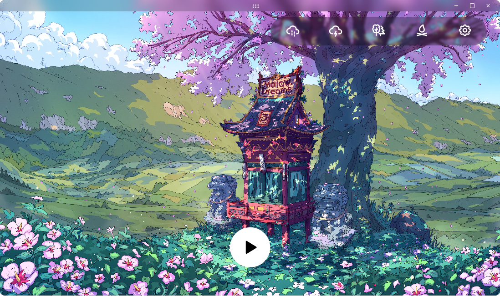

# LoFi Engine
Generate LoFi music on the go. You create your own atmosphere LoFi Engine sets the mood.

## Features 🚀
* Create your own LoFi studio with your unique music with minimal touches from this and that, be the Artist.
* Works with major desktop platforms *Linux,* *Mac,* and *Windows*.
* Doesn't require internet connection, your experience is fully private. 
* LoFi Engine main focus is *customization*, *accessibility* and *artistic freedom*.
### customization
1. **Playback**: If you want to listen to music or just listen to birds singing freely, you choose.
2. **Look**: With carefully crafted artworks from talented artists makes the long study session a peice of joy.
3. **Ambience**: A windy evening, or the sound of waves crushing into the sand of a sunny beach brings peace.
### Accessibility
Any actions or clicks you can do with the mouse there is a shortcut for it with the keyboard. For playback, effects, ambient tracks, look, etc.

All information about the app and **shortcuts** is available in the *info box* accessible via the ==ESC== key.

## Future Plan
At the moment there is only one main LoFi track playing in a loop. For a better and customizable experience the main LoFi track should be generated on the go. The current suitable solution could be done using **Magenta.js**, [learn more!](https://magenta.tensorflow.org/).

## License
On hold right now 🐌

