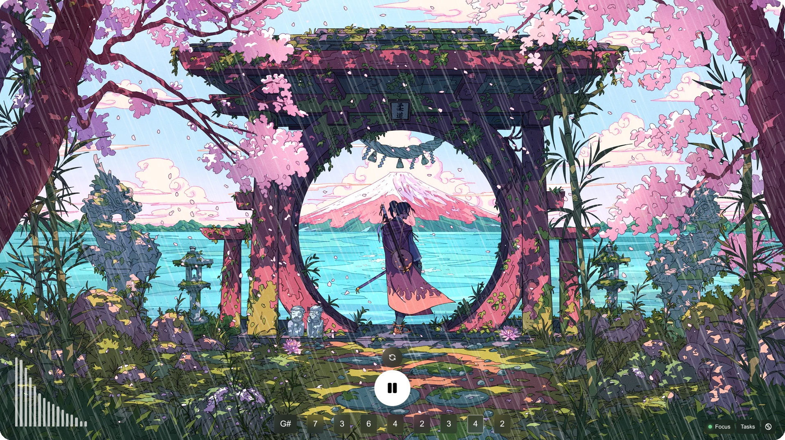

# LoFi Engine
<p align="center">
    
</p>

Generate LoFi music on the go. You create your own atmosphere; LoFi Engine sets the mood.

<p align="center">
  <a href="https://github.com/meel-hd/lofi-engine/releases/tag/app-v1.2.0">
    
  </a>
</p>

<p align="center">
   
</p>

## Sponsors

<p align="center">
    <picture>
      <source media="(prefers-color-scheme: dark)" srcset="https://insion.co/logo-dark.svg" />
      
    </picture>
  <a href="https://insion.co/"><strong>Insion</strong></a>&nbsp;&nbsp;
  <a href="https://insion.co/">
  </a>
</p>

<p align="center">
   <samp>Build safer products with intelligent content moderation.</samp>
</p>

## Table of Contents
- [Tech Stack](#tech-stack)
- [Features](#features)
- [Productivity](#productivity)
- [Run Locally](#run-locally)
- [Contributing](#contributing)
- [License](#license)

## Tech Stack

[](https://svelte.dev/)
[](https://www.typescriptlang.org/)
[](https://vitejs.dev/)
[](https://tauri.app/)
[](https://pnpm.io/)
[](https://tonejs.github.io/)


## Features
* Create your own LoFi studio with your unique music with minimal touches from this and that. Be the Artist.
* Works with major desktop platforms: **Linux**, **Mac**, and **Windows**.
* Doesn't require an internet connection; your experience is fully private.
* LoFi Engine's main focus is **customization**, **accessibility**, and **artistic freedom**.

### Customization
1. **Playback**: If you want to listen to music or just listen to birds singing freely, you choose.
2. **Look**: With carefully crafted artworks from talented artists, long study sessions become a joy.
3. **Ambience**: A windy evening or the sound of waves crashing into the sand of a sunny beach brings peace.

### Advanced Immersion
The **Immersion** system, code name: `Auto DJ`, automatically manages the soundscape for you. It offers different modes to suit your needs:
- **Music**: Focuses on the beat and chords without atmospheric effects.
- **Atmosphere**: Adds core weather and nature effects for a fuller sound.
- **World**: Incorporates specific textures like city sounds or wind for deep immersion.
- **Manual**: Gives you full control to mix and match sounds as you please.

### Productivity

Stay in flow without leaving your scene:

- **Pomodoro timer** with configurable focus and break durations, automatic phase switching, and desktop notifications.
- **Focus tasks** to select what you are working on, track completed Pomodoros, and keep completed work organized.
- **Focus stats** with daily and weekly totals plus a seven-day focus-time graph.
- **Zen mode** to hide the track list and effects controls while your scene and music continue.
- **Desktop conveniences**: mini player mode and a system-tray menu for window visibility, play/pause, phase skipping, and quitting.

### Internationalization
LoFi Engine speaks your language! We have support for multiple languages to make the experience accessible to everyone.
- **English**
- **French** (Français)
- **Spanish** (Español)
- **Japanese** (日本語)
- **Korean** (한국어)
- **Indonesian** (Bahasa Indonesia)
- **Russian** (Русский)

### Accessibility
Any action or click you can do with the mouse has a shortcut for it with the keyboard. For playback, effects, ambient tracks, look, etc.

All information about the app and **shortcuts** is available in the *info box* accessible via the **Right Click** Context menu > **About**.

### Procedural LoFi Track Generation

The LoFi track is generated procedurally using **Tone.js**, providing a dynamic and unique listening experience every time. 

If you have suggestions or encounter any issues, please let us know by opening an issue or contributing directly to the project. Together, we can make LoFi Engine even better!

## Run Locally

To run LofiEngine locally, follow these steps:

### Prerequisites

- [Node.js](https://nodejs.org/) (v14 or later)
- [pnpm](https://pnpm.io/) (v6 or later)
- [Rust](https://www.rust-lang.org/) (latest stable version)
- [Tauri prerequisites](https://tauri.app/v1/guides/getting-started/prerequisites) (based on your operating system)

### Installation

1. Clone the repository:
   ```
   git clone https://github.com/meel-hd/lofi-engine
   cd lofi-engine
   ```

2. Install dependencies:
   ```
   pnpm install
   ```

### Development

To run the app in development mode:

```
pnpm tauri:d
```

This command will start both the Vite dev server for the frontend and the Tauri development process for the native shell.

### Building

To build the app for production:

```
pnpm tauri:b
```

This will create a production-ready build of your application in the `src-tauri/target/release` directory.

### Additional Commands

- `pnpm dev`: Run the Vite development server without Tauri
- `pnpm build`: Build the frontend assets without Tauri
- `pnpm preview`: Preview the built frontend
- `pnpm check`: Run Svelte type checking

## Contributing

Contributions are welcome. See the [Contributing Guide](./CONTRIBUTING.md) for details, and check the [issue tracker](https://github.com/meel-hd/lofi-engine/issues) if you want to help, report a bug, or discuss new ideas.

## License
This project is licensed under the [MIT License](LICENSE).
Feel free to use, modify, and distribute this code as per the terms of the license.
